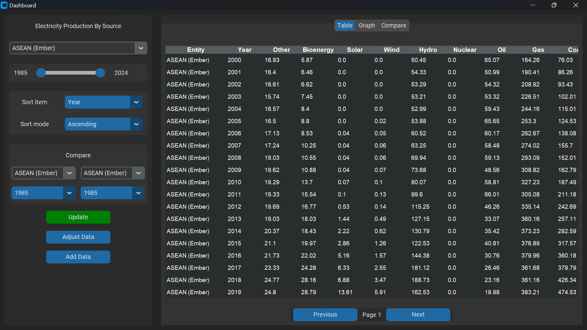
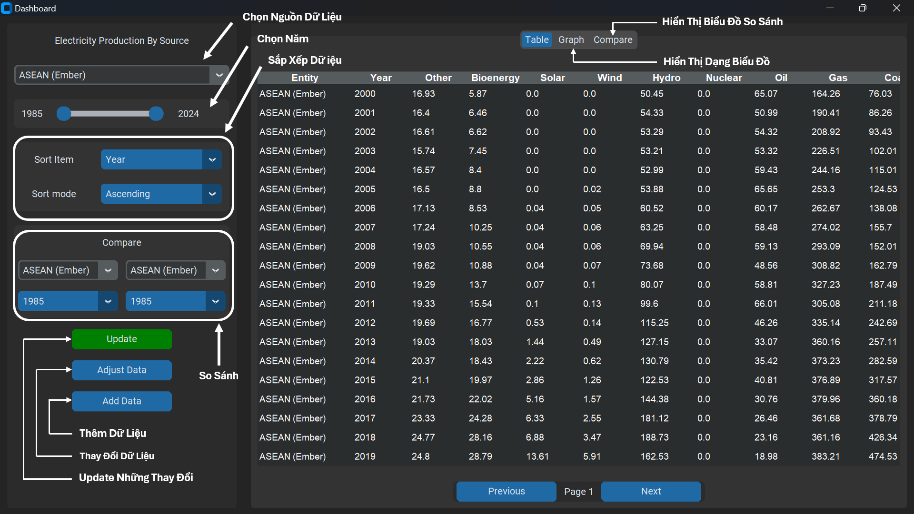
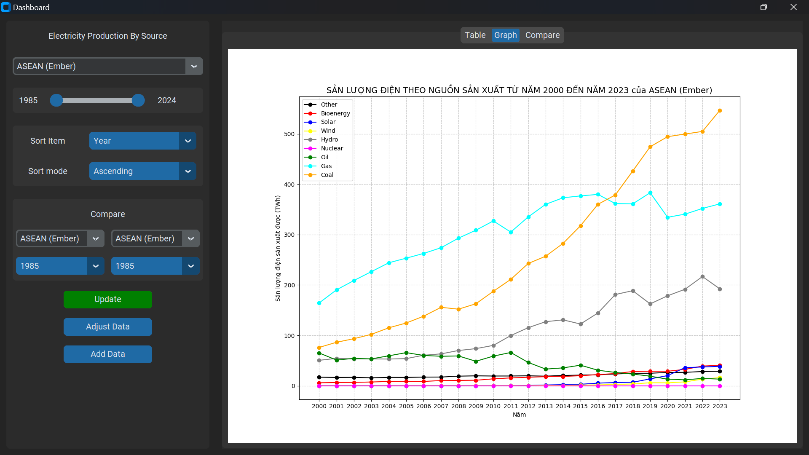
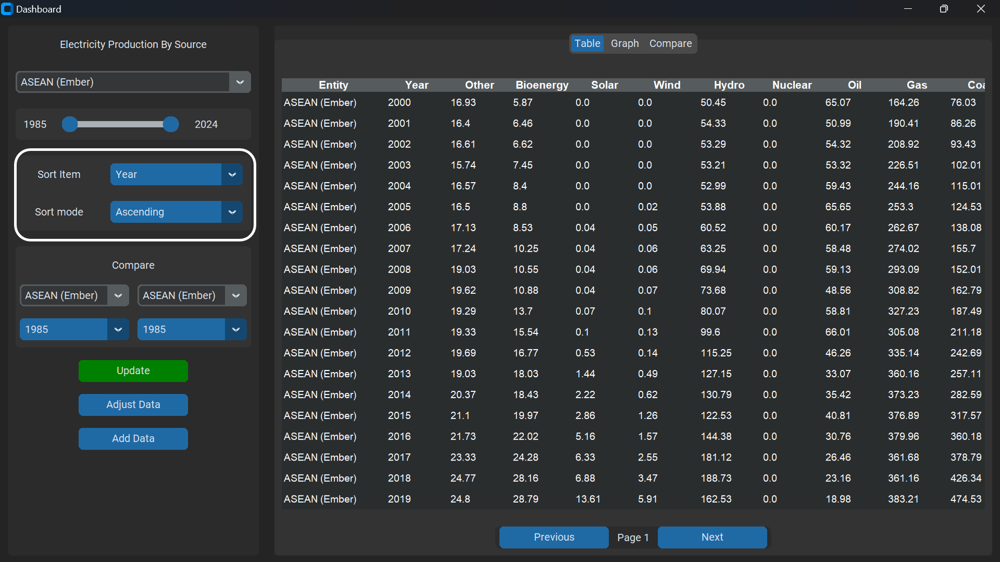
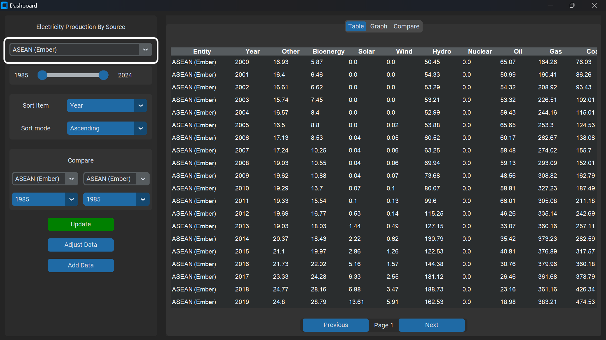
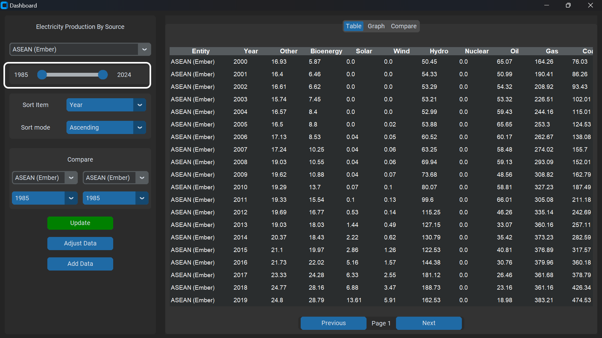
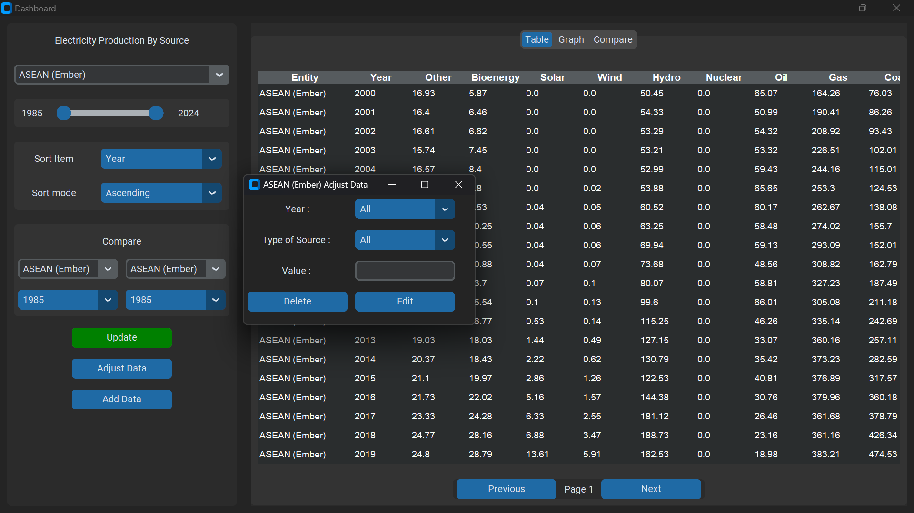
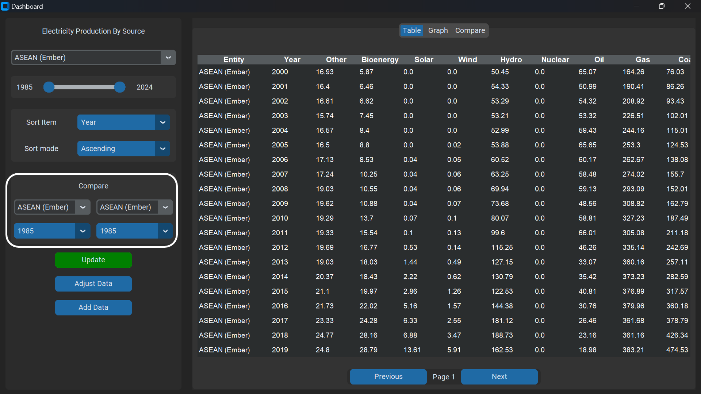
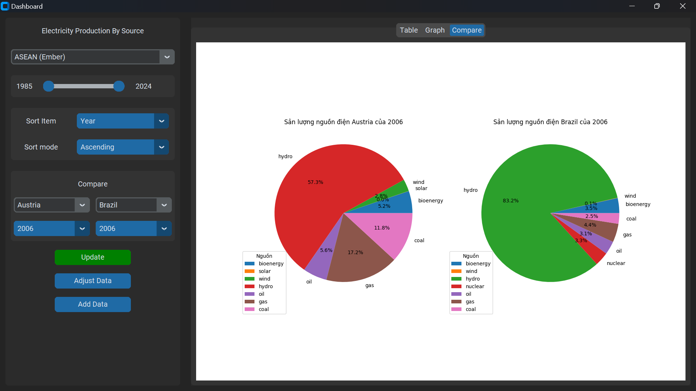
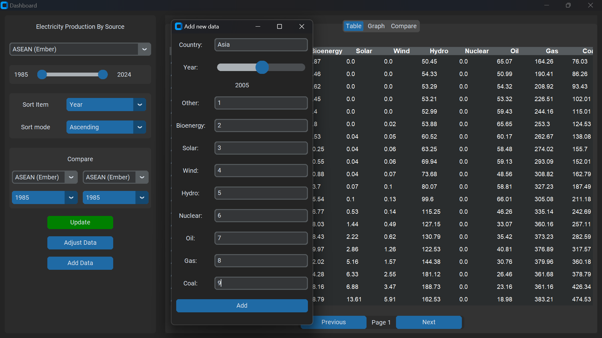

# ĐỒ ÁN CUỐI KỲ MÔN NHẬP MÔN LẬP TRÌNH PYTHON

#### THÀNH VIÊN NHÓM:

###### 1. Huỳnh Đức Hoàng *(MSSV: 24154039)*
Nhiệm vụ: Kết nối giao diện - chức năng
###### 2. Lê Thắng *(MSSV: 24154116)*
Nhiệm vụ: Code chức năng thêm - xóa - sửa dữ liệu
###### 3. Nguyễn Hữu Khánh *(MSSV: 24154053)*
Nhiệm vụ: Code vẽ biểu đồ
###### 4. Phạm Nguyễn Trung Tín *(MSSV: 24154122)*
Nhiệm vụ: Code giao diện chính
###### 5. Phan Bình Minh *(MSSV: 24154071)*
Nhiệm vụ: Code chức năng khai thác - đọc dữ liệu

### Mô Tả - Hướng Dẫn Sử Dụng Chương Trình Khai Thác Dữ Liệu Điện Của Các Quốc Gia - Vùng Lãnh Thổ - Châu Lục - Thế Giới

##### 1. Mô Tả Về Chương Trình:

Chương trình khai thác và thao tác trên dữ liệu các quốc gia này là một chương trình cho phép người dùng *tìm kiếm*, *thay đổi*, *thêm* và *xóa* các loại dữ liệu khác nhau của nhiều quốc gia, vùng lành thổ, châu lục và cả thế giới. Ngoài ra người dùng còn có thể lựa chọn trực quang hóa dữ liệu đó hoặc so sánh những dữ liệu mà người dùng muốn thông qua phương pháp vẽ biểu đồ mà chương trình hỗ trợ.

##### 2. Hướng Dẫn Setup Môi Trường Hoạt Động:

Mở và chạy file setup để cài đặt các thư viện còn thiếu nhằm hoàn thiện môi trường hoạt động của chương trình.

Nếu không tồn tại file setup trong những thư mục có sẵn, hãy tạo một file setup mới như sau:

##### setup.py
``` python

import sys
import subprocess

subprocess.check_call([sys.executable, '-m', 'pip', 'install','--upgrade','pip', 'setuptools'])

import pkg_resources

required  = {'customtkinter','numpy', 'matplotlib'} 
installed = {pkg.key for pkg in pkg_resources.working_set}
missing   = required - installed

if missing:
    # implement pip as a subprocess:
    subprocess.check_call([sys.executable, '-m', 'pip', 'install', *missing])
```

##### 3. Hướng Dẫn Sử Dụng Chương Trình:
###### 3.1 Hướng Dẫn Các Thao Tác Trên Giao Diện Chính:

Ảnh dưới đây chính là hình ảnh khi chương trình được khởi chạy:



Cụ thể, có thể hiểu như sau:


Khi người dùng chọn lựa chọn trực quang hóa dữ liệu, ta sẽ có giao diện như sau:


*Lưu ý: hình dạng và số liệu biểu đồ sẽ thay đổi tùy theo loại dữ liệu mà người dùng chọn để biểu diễn cũng như khai thác thông tin* 

*Sắp xếp dữ liệu*
Người dùng có thể lựa chọn sắp xếp dữ liệu theo các trường dữ liệu theo chiều tăng dần hoặc giảm dần tùy theo lựa chọn của người dùng:


###### 3.2 Hướng Dẫn Sử Dụng Tính Năng Thay Đổi Loại Dữ Liệu Biểu Diễn Và Thay Đổi, Xóa Dữ Liệu (Adjust Data)

1. Thay đổi dữ loại dữ liệu biểu diễn 

a. Người dùng chọn mục quốc gia và lựa chọn dữ liệu của quốc gia mà người dùng muốn thay đổi:
*(quốc gia người dùng sẽ phải bấm chọn)*


b. Người dùng chọn mốc năm và quốc gia mà người dùng muốn lấy dữ liệu:
*(mốc năm người dùng sẽ phải kéo thả)*



Sau khi đã chọn đúng loại dữ liệu mà người dùng muốn hãy nhấn nút "Update" để có thể thay đổi dữ liệu và biểu đồ đang tồn tại.


2. Sửa đổi, xóa dữ liệu
Chọn vào mục "Adjust Data" để có thể thực hiện hành động sửa đổi, xóa bỏ dữ liệu.



Sau khi đã nhập năm, loại dữ liệu và giá trị mới thì chọn mục "Delete" hoặc "Edit" tùy theo lựa chọn của người dùng.


###### 3.3 Hướng Dẫn Sử Dụng Tính Năng So Sánh Dữ Liệu (Compare)
Để có thể sử dụng chức năng so sánh dữ liệu, người dùng cần thao tác trên mục "Compare"
Người dùng cần lựa chọn những quốc gia và năm cần so sánh ở mục "Compare"


Sau khi lựa chọn xong, người dùng cần chọn "Update" và chuyển sang mục compare để có thể thấy được bảng dữ liệu thống kê


###### 3.4 Thêm Dữ Liệu (Add Data)
Để có thể sử dụng chức năng thêm dữ liệu, người dùng chọn ô "Add Data" rồi thực hiện lựa chọn và nhập dữ liệu vào những mục yêu cầu như hình bên dưới:


Sau khi đã nhập dữ liệu xong người dùng chọn "Add" và chọn nút "Update" để có thể cập nhật những dữ liệu mà người dùng vừa nhập vào dữ liệu gốc


