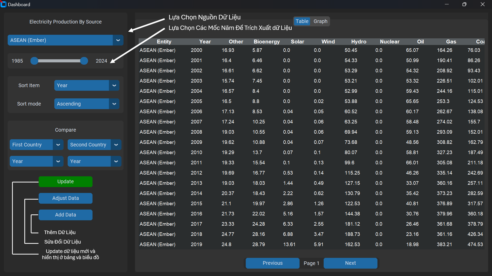

# ĐỒ ÁN CUỐI KỲ MÔN NHẬP MÔN LẬP TRÌNH PYTHON

#### THÀNH VIÊN NHÓM:

1. Huỳnh Đức Hoàng *(MSSV: 24154039)*
2. Lê Thắng *(MSSV: 24154116)*
3. Nguyễn Hữu Khánh *(MSSV: 24154053)*
4. Phạm Nguyễn Trung Tín *(MSSV: 24154122)*
5. Phan Bình Minh *(MSSV: 24154071)*

### Mô Tả Chương Trình Khai Thác Dữ Liệu Điện Của Các Quốc Gia - Vùng Lãnh Thổ - Châu Lục - Thế Giới

##### 1. Mô Tả Về Chương Trình:

Chương trình khai thác và thao tác trên dữ liệu các quốc gia này là một chương trình cho phép ta *tìm kiếm*, *thay đổi*, *thêm* và *xóa* các loại dữ liệu khác nhau của nhiều quốc gia, vùng lành thổ, châu lục và cả thế giới. Ngoài ra người dùng còn có thể lựa chọn trực quang hóa dữ liệu đó thông qua phương pháp vẽ biểu đồ mà chương trình hỗ trợ.

##### 2. Hướng Dẫn Setup Môi Trường Hoạt Động:

Mở và chạy file setup để cài đặt các thư viện còn thiếu nhằm hoàn thiện môi trường hoạt động của chương trình

Nếu không tồn tại file setup trong những thư mục cóa sẵn, hãy tạo mọt file setup mới như sau:

### setup.py
``` python

import sys
import subprocess

subprocess.check_call([sys.executable, '-m', 'pip', 'install','--upgrade','pip', 'setuptools'])

import pkg_resources

required  = {'customtkinter','numpy', 'matplotlib'} 
installed = {pkg.key for pkg in pkg_resources.working_set}
missing   = required - installed

if missing:
    # implement pip as a subprocess:
    subprocess.check_call([sys.executable, '-m', 'pip', 'install', *missing])
```

##### 3. Hướng Dẫn Sử Dụng Chương Trình:
###### 3.1 Hướng Dẫn Thay Đổi Loại Dữ Liệu Và Trực Quang Hóa Dữ Liệu:

Ảnh dưới đây chính là hình ảnh khi chương trình được khởi chạy:


Cụ thể ta có thể hiểu như sau:

